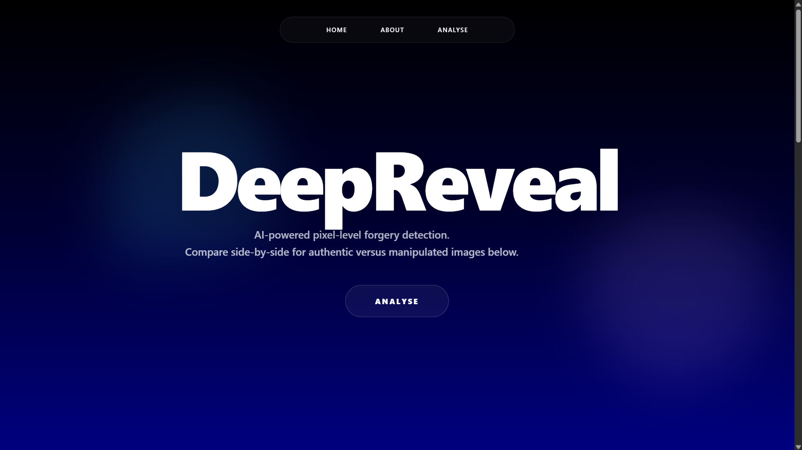
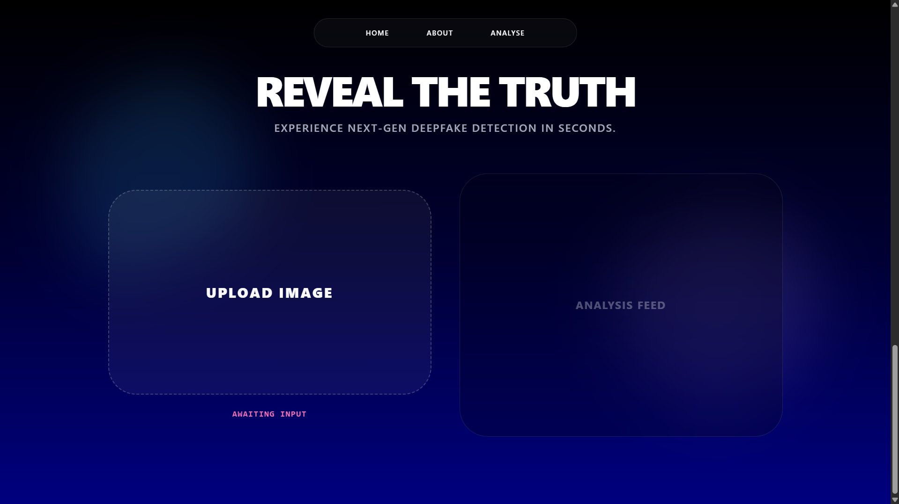
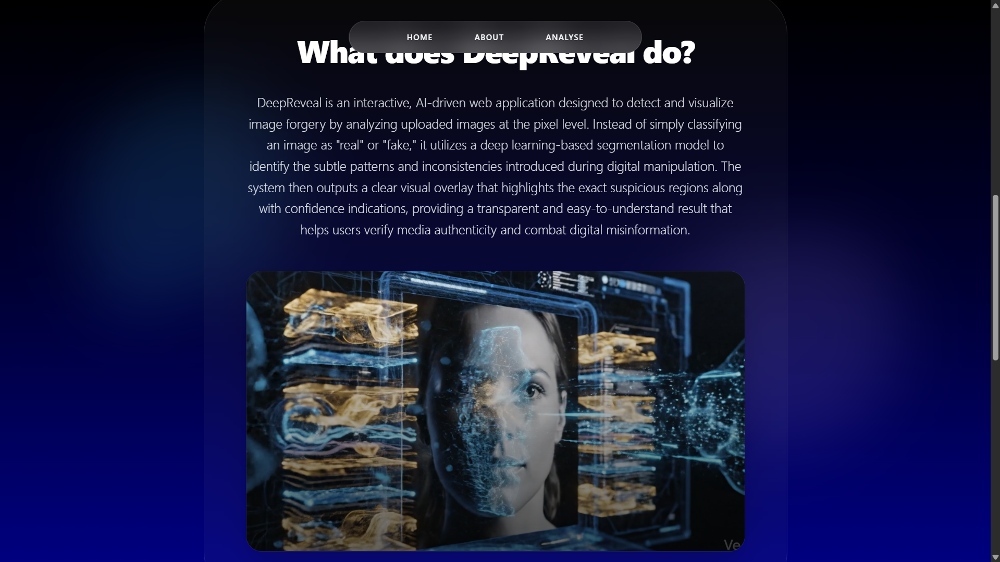
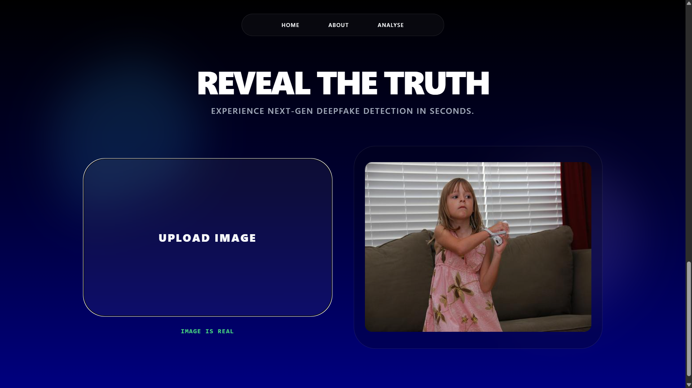
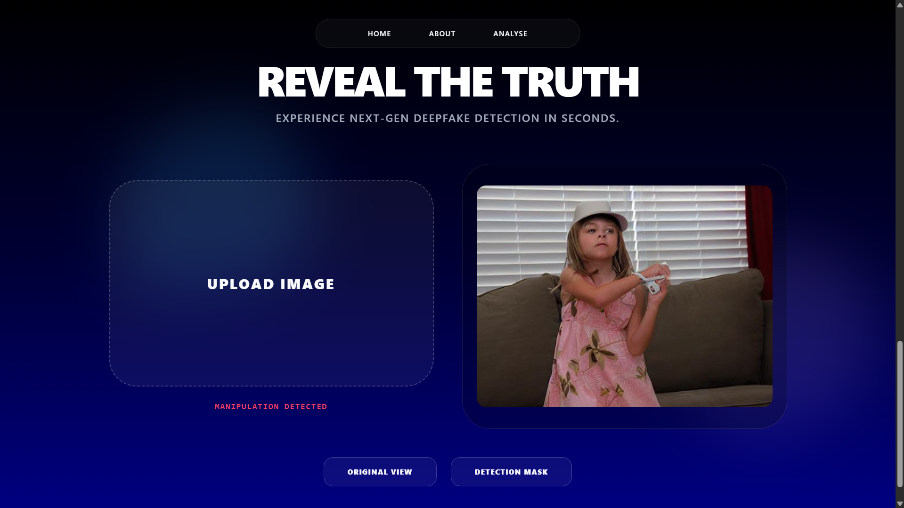
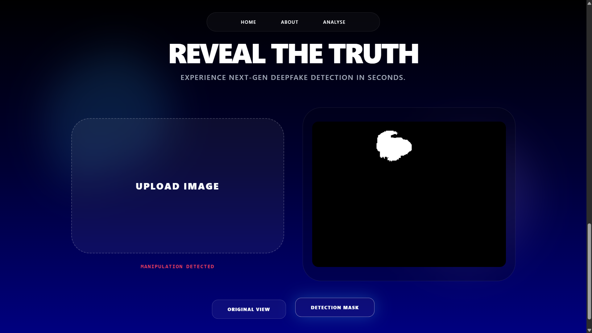
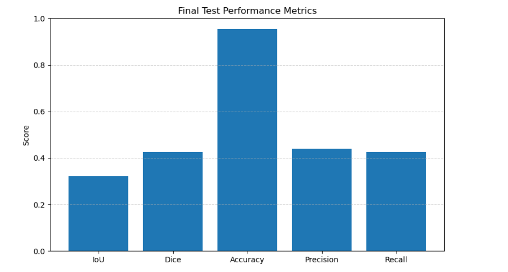
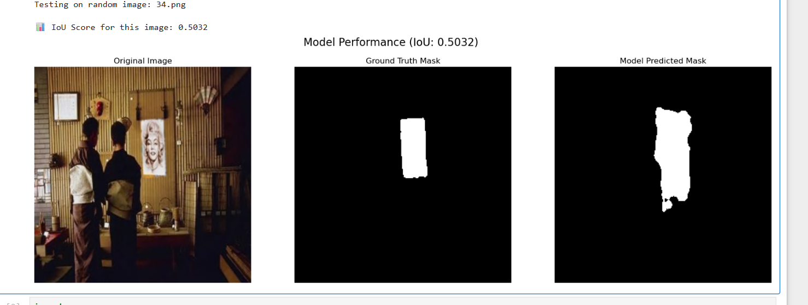

# 🕵️‍♂️ DeepReveal
## AI-Generated Image Manipulation Detection using Deep Learning

<p align="center">
  
</p>

<p align="center">
  
  
  
  
  
  
  
</p>

---

# 📌 Overview

DeepReveal is a deep learning-based image forensics system developed to detect AI-generated or manipulated regions at the pixel level.

Unlike traditional classification approaches, DeepReveal performs semantic segmentation to precisely localize manipulated regions within an image using a U-Net segmentation architecture.

The system includes:

- Deep learning segmentation model
- Computer vision preprocessing pipeline
- Flask-powered web application
- Pixel-level manipulation visualization

This project was developed using PyTorch, OpenCV, and Flask.

---

# 🎥 Project Demo

<p align="center">
  
</p>

---

# 🚀 Features

✅ Pixel-level manipulation detection  
✅ U-Net segmentation architecture  
✅ Real-time image analysis  
✅ Flask-based web application  
✅ Upload and analyze custom images  
✅ Binary mask visualization  
✅ Manipulated region localization  
✅ Deep learning inference pipeline  

---

# 🧠 Model Details

| Component | Details |
|-----------|---------|
| Architecture | U-Net |
| Framework | PyTorch |
| Input Size | 224 × 224 |
| Output | Binary Segmentation Mask |
| Threshold | 0.5 |
| Task | Manipulation Segmentation |

---

# 🧭 DeepReveal Pipeline

<details>
<summary>🔍 Click to View Pipeline</summary>

```text
Input Image
     ↓
Preprocessing
     ↓
U-Net Segmentation Model
     ↓
Sigmoid Activation
     ↓
Thresholding
     ↓
Binary Mask Generation
     ↓
Manipulated Region Detection
```

</details>

---

# 🔬 Preprocessing & Inference

<details>
<summary>⚙️ View Processing Steps</summary>

## Image Preprocessing
- BGR → RGB conversion
- Resize to 224 × 224
- Pixel normalization [0,1]
- Tensor conversion

## Inference Pipeline
- Forward propagation
- Sigmoid activation
- Thresholding at 0.5
- Binary mask generation

## Output Interpretation
- ⚪ White Pixels → Manipulated Region
- ⚫ Black Pixels → Authentic Region

</details>

---

# 🌐 Web Application

## 🏠 Home Page

<p align="center">
  
</p>

---

## 🔍 Analyze Page

<p align="center">
  
</p>

---

## 📄 About Page

<p align="center">
  
</p>

---

# 📸 Prediction Results

## 🖼️ Real vs Fake Detection

| Real Image | Fake Image |
|------------|------------|
|  |  |

---

## 🎯 Manipulated Region Detection

<p align="center">
  
</p>

---

# 📊 Model Performance Metrics

<p align="center">
  
</p>

---

# 🔍 Initial Model Testing

<p align="center">
  
</p>

---

# 🔄 Model Comparison

| Feature | Initial Model | U-Net |
|----------|---------------|-------|
| Output Type | Classification | Segmentation |
| Localization | Weak | Strong |
| Pixel-level Detection | ❌ | ✅ |
| Visualization | Limited | Detailed |
| Detection Accuracy | Moderate | High |

---

# 📂 Project Structure

```bash
DeepReveal/
│── app.py
│── model_utils.py
│── models/
│── templates/
│── static/
│── notebooks/
│── images/
│── README.md
```

---

# ⚙️ Installation

## Clone Repository

```bash
git clone https://github.com/Ammuelizabeth/DeepReveal.git
cd DeepReveal
```

## Install Dependencies

```bash
pip install flask torch torchvision opencv-python numpy
```

## Run Application

```bash
python app.py
```

---

# 🛠️ Tech Stack

| Technology | Purpose |
|------------|---------|
| Python | Core Programming |
| PyTorch | Deep Learning |
| OpenCV | Image Processing |
| Flask | Web Backend |
| HTML | Frontend |
| Tailwind CSS | UI Design |

---

# 📊 Evaluation Metrics

| Metric | Score |
|--------|------|
| IoU Score | 0.3214 |
| Dice Coefficient | 0.4256 |

---

# 🤝 Contributors

### 👩‍💻 Team Members

- Ammu Elizabeth Alexander  
- Anakha Prakash  
- Aiswrya Josy  
- Abin Joseph  

---

# 📬 Contact

📧 ammuelizabethalexander@gmail.com

---

# ⭐ Support

If you found this project useful, consider giving this repository a ⭐ on GitHub.

---

<p align="center">
  <b>Made with ❤️ using PyTorch, OpenCV, and Flask</b>
</p>
